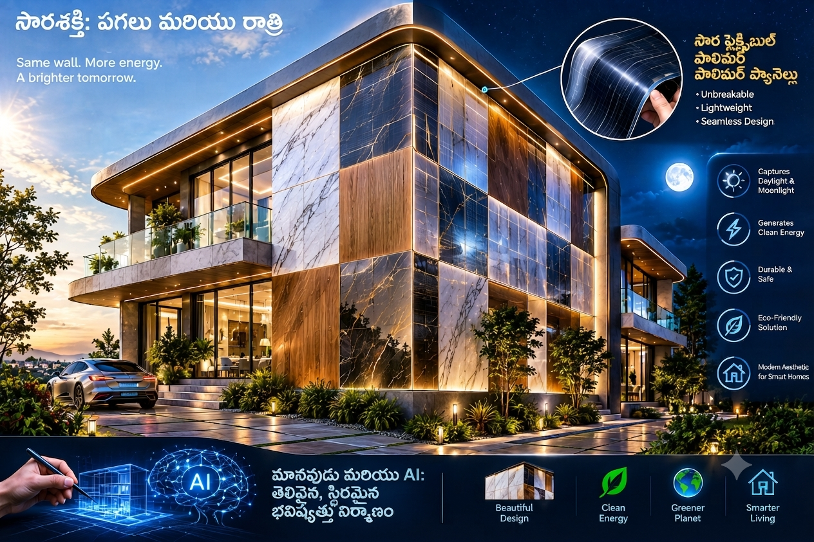

# Omni-Source BIPV Energy Wall: The 24/7 Architectural Power Cladding
## ఓమ్ని-సోర్స్ BIPV ఎనర్జీ వాల్: 24/7 ఆర్కిటెక్చరల్ పవర్ క్లాడింగ్

**Conceived & Envisioned by / సృష్టికర్త:** Ramarao Male  
**Co-created with / సహకారం:** AI Collaboration (Human-AI Open-Source Concept)  

---



*(Note: Replace the placeholder link above with your uploaded image link in your repository)*

---

### 📌 Introduction / పరిచయం
**[English]:** Conventional solar panels compromise building aesthetics and carry structural safety risks like glass breakage. This project re-imagines exterior building walls as "All-in-One Omni-Source Energy Harvesters" that maximize power generation from every light and heat source 24/7, with 100% unbreakable safety and custom aesthetics.

**[తెలుగు]:** కన్వెన్షనల్ సోలార్ ప్యానెల్స్ వల్ల బిల్డింగ్స్ అందం తగ్గిపోవడంతో పాటు గ్లాస్ బ్రేకింగ్, సేఫ్టీ రిస్క్ లు ఉంటున్నాయి. ఈ సమస్యకు చెక్ పెడుతూ, బిల్డింగ్ గోడలను పూర్తిగా సురక్షితమైన, అందమైన మరియు 24/7 ఎనర్జీని ఇచ్చే "ఆల్-ఇన్-వన్ ఓమ్ని-సోర్స్ వాల్" గా మార్చడమే ఈ ప్రాజెక్ట్ ప్రధాన ఉద్దేశం.

---

### 🏗️ Technical Specifications & Key Features / ప్రధాన విశేషాలు

**1. 100% Safe & Unbreakable / వంద శాతం సురక్షితం & పగిలిపోని మెటీరియల్:**
* **[EN]:** Replaces traditional fragile glass with high-grade, flexible, impact-resistant ETFE polymer layers. No shattering or falling shards.
* **[TE]:** గాజుకు బదులుగా హై-గ్రేడ్ ఫ్లెక్సిబుల్ పాలిమర్ (ETFE) మెటీరియల్ వాడకం వల్ల ఎట్టి పరిస్థితుల్లోనూ పగిలిపోయే ప్రమాదం లేదు.

**2. 24/7 Omni-Source Energy Harvesting / 24 గంటలూ ఎనర్జీ సేకరణ:**
* **[EN]:** Captures energy across daytime (direct sunlight + ambient light) and nighttime (moonlight, starlight, artificial street/office lights, and thermal waste heat radiation from walls via thermoelectric layers).
* **[TE]:** పగటిపూట సూర్యకాంతి + యాంబియంట్ లైట్; రాత్రిపూట చంద్రుని కాంతి, కృత్రిమ లైట్లు, మరియు గోడల నుండి వెలువడే వేడి (Waste Heat) నుంచి కూడా ఎనర్జీని సేకరించడం.

**3. Custom Aesthetics & Art Solar / స్టైలిష్ లుక్ & కస్టమ్ డిజైన్స్:**
* **[EN]:** Panels resemble high-end architectural elements like marble, granite, or wood texture with permanent nano-color fastness (zero fading).
* **[TE]:** సోలార్ ప్యానెల్ లా కాకుండా, మార్బుల్, వుడెన్ లేదా కస్టమ్ డిజైన్ టైల్స్ లా కనిపిస్తూ బిల్డింగ్ లుక్‌ను పెంచుతుంది. కలర్ ఎప్పటికీ ఫేడ్ కాదు.

---

### 🎨 AI Image Generation Prompt / ఇమేజ్ క్రియేషన్ ప్రాంప్ట్
Use this prompt in AI image generators to create concept visuals:
```text
A futuristic modern building exterior wall covered in seamless, unbreakable flexible polymer solar panels designed as elegant marble and wooden aesthetic tiles. The wall is capturing energy from both soft daylight and subtle moonlight/ambient glow at night. High-end architectural design, safe, sleek, photorealistic, 8k resolution, designed through human-AI collaboration concept.
